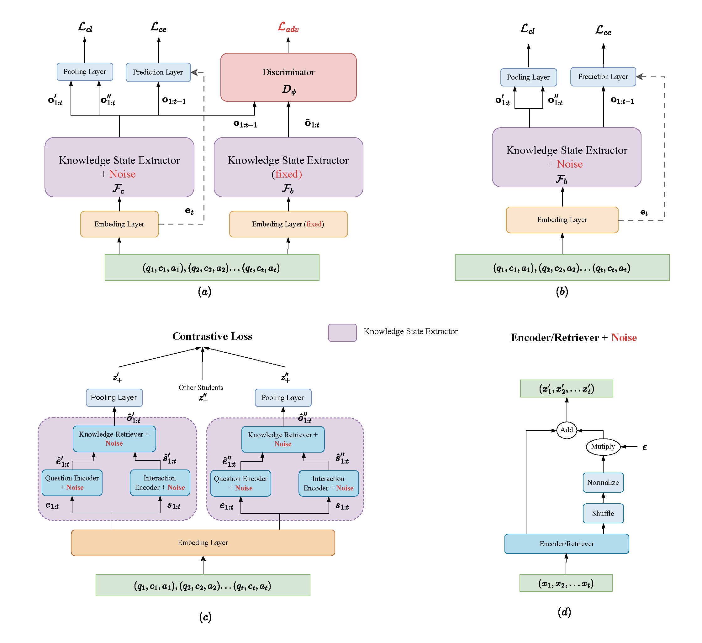

# DACE: Debiased Cognition Representation Learning for Knowledge Tracing
Considering some abnormal behaviors (like guessing and plagiarism) lead to the existence of bias data in students' interaction answer records, we propose the DACE model to learn a robust and debiased representation of knowledge states for reliable prediction on the KT task. 

### Briefly introduce the DACE model


Given the processed interaction data, the whole framework mainly contains two modules:
1.  Two knowledge state extractors: Both of them utilize a sequential contrastive learning network to learn representations of knowledge state. However, they are trained differently to capture distinct aspects of the data. 
2. Training process: The biased knowledge state extractor is trained using a combination of contrastive loss and cross-entropy loss, with an early stop mechanism. The unbiased extractor is trained independently by minimizing the information bottleneck loss. 

For more details, please read our paper: "__Debiased Cognition Representation Learning for Knowledge Tracing__"

### How to train the DACE model
1. Data Preparation: 
   - Download and unzip [assist09 data](https://drive.google.com/uc?export=download&id=14wBw8BHf9e328v4dD5EdsRMtR_gCFcdq) in `data` directory. 
   - Download and unzip [question embedding](https://drive.google.com/uc?export=download&id=16s9jNZZSkxT33Hb7r1OY7PqkJBzhC5DV) in `embeddings` directory.
2. Bias Injection: 
   - Modify the `config.py` by specifying the `biased types` (e.g., plagiarism, guessing) and adjusting the `injection proportion` and `p`.
3. Main Files: 
   - Run the following command: 
        ```
        python train.py # pretrain sequence model on biased dataset
        python run.py # train on biased dataset and evaluate on clean dataset
        ```

Please note that, this model is also suitable for regular KT prediction. If you want to test the performance on normal KT datasets, simply set the `biased type` to `None`.

### Results

<table>
  <tr>
    <th>Dataset</th>
    <th>Biased Types</th>
    <th>AUC(%)</th>
    <th>ACC(%)</th>
  </tr>
  <tr>
    <td rowspan="4">Assist09</td>
    <td>None</td>
    <td>81.33</td>
    <td>75.48</td>
  </tr>
  <tr>
    <td>Plagiarism</td>
    <td>80.44</td>
    <td>73.76</td>
  </tr>
  <tr>
    <td>Plagiarism-pro</td>
    <td>79.45</td>
    <td>74.42</td>
  </tr>
  <tr>
    <td>Guessing</td>
    <td>80.72</td>
    <td>74.90</td>
  </tr>
  <tr>
    <td rowspan="4">Ednet</td>
    <td>None</td>
    <td>76.06</td>
    <td>70.48</td>
  </tr>
  <tr>
    <td>Plagiarism</td>
    <td>74.52</td>
    <td>68.22</td>
  </tr>
  <tr>
    <td>Plagiarism-pro</td>
    <td>72.79</td>
    <td>68.15</td>
  </tr>
  <tr>
    <td>Guessing</td>
    <td>75.03</td>
    <td>69.86</td>
  </tr>
</table>