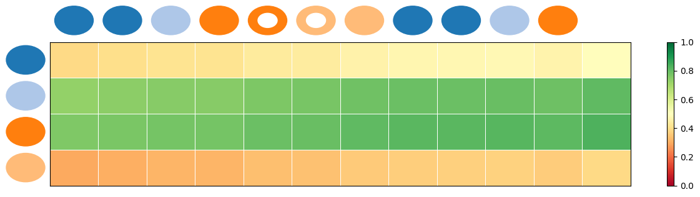
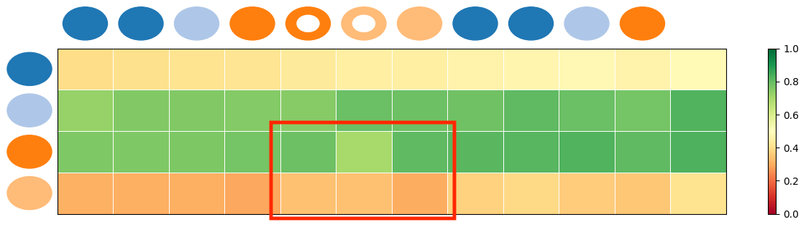

## Biased and unbiased knowledge tracing results of one example student 

**Figure 7: Biased knowledge tracing results.**

**Figure 8: Unbased knowledge tracing results.**

Our initial approach focused on predicting outcomes based on the question level. To delve into knowledge tracking at a skill level, we opt to average the embeddings of questions associated with each knowledge concept. This averaged representation serves as input to the model, capturing the current knowledge state of the skill.

To illustrate biased and unbiased knowledge tracing outcomes, we analyze a real learning sequence, showcasing our estimation of mastery level evolution for each knowledge concept. Training is conducted under a plagiarism-bias scenario, with evaluations performed on a clean learning sequence.

In the visualizations, circles denote distinct knowledge concepts, with each row depicting the evolution of a specific concept's mastery. A white dot within a circle signifies an incorrect response. Figures 5 and 6 exemplify unbiased and biased knowledge tracing outcomes, respectively, under a plagiarism bias.

Notably, We can observe an increase in the mastery of knowledge states over time, even when encountering incorrect responses, which may result from a high probability of correct answers under plagiarism bias from Figure 5. The unbiased knowledge extractor swiftly adjusts knowledge states in response to errors, underscoring our method's efficacy in adeptly tracking knowledge states, even when trained on biased datasets.